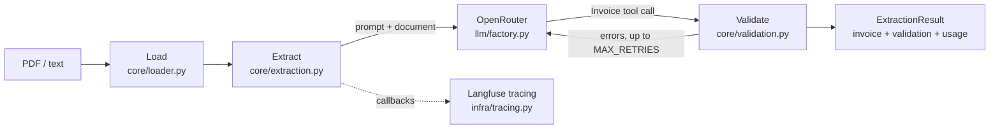

# invoice-extractor

LangChain pipeline that turns invoices and receipts (PDF or text) into validated, structured JSON,
with consistency checks and self-correcting retries.

## Features

- Accepts PDF or plain text, as an uploaded file or raw JSON text.
- Extracts a structured `Invoice` (parties, line items, totals) via an LLM reached through
  OpenRouter, using function-calling structured output.
- Validates line totals, net total, VAT per rate and gross total, plus the Italian partita IVA
  checksum.
- Self-corrects: validation and schema errors are sent back to the model, up to `MAX_RETRIES`
  times, before returning a result with `valid: false`.
- Batch endpoint with bounded concurrency; each file's failure is reported independently.
- Optional Langfuse tracing: one trace per extraction, with each retry attempt as a separate
  generation, and token/cost/latency usage in every response.
- Streamlit UI for single and batch uploads, backed by the API over HTTP only.

## Architecture



See [`docs/architecture.md`](docs/architecture.md) for the component breakdown and the
[`docs/code-map.md`](docs/code-map.md) for the module graph. Product scope and requirements are in
[`docs/design.md`](docs/design.md).

## Quickstart

### Docker Compose

```bash
docker compose up --build
```

- API: http://localhost:8000 (docs at `/docs`)
- UI: http://localhost:8501

Set `OPENROUTER_API_KEY` (and optionally the Langfuse keys) in a `.env` file next to
`docker-compose.yml`; all variables are listed under [Configuration](#configuration).

### Local development with uv

```bash
uv sync
uv run uvicorn invoice_extractor.api.app:app --reload
API_URL=http://localhost:8000 uv run streamlit run src/invoice_extractor/ui/app.py
```

## API

### `POST /extract`

Multipart file upload:

```bash
curl -F "file=@samples/invoice_en_clean.txt" http://localhost:8000/extract
```

Or raw JSON text:

```bash
curl -X POST http://localhost:8000/extract \
  -H "Content-Type: application/json" \
  -d '{"text": "Invoice #123 ..."}'
```

Response shape:

```json
{
  "invoice": { "document_type": "invoice", "number": "...", "line_items": ["..."], "..." : "..." },
  "validation": { "valid": true, "errors": [], "retries": 0 },
  "usage": { "input_tokens": 0, "output_tokens": 0, "cost_usd": null, "latency_ms": 0 },
  "document_text": "the text the model read, for previews",
  "trace_url": "https://cloud.langfuse.com/... or null when tracing is off"
}
```

### `POST /extract/batch`

```bash
curl -F "files=@samples/invoice_en_clean.txt" -F "files=@samples/receipt_coworking.txt" \
  http://localhost:8000/extract/batch
```

Returns a list of `{filename, result, error}`, one item per file, processed concurrently
(`BATCH_CONCURRENCY` at a time, up to `MAX_BATCH_FILES` per request); a failing file never fails
the whole batch.

### `GET /health`

```bash
curl http://localhost:8000/health
```

### Error statuses

| Status | Meaning |
|---|---|
| 411 | request has no `Content-Length` header |
| 413 | file larger than `MAX_UPLOAD_MB`, PDF over `MAX_PDF_PAGES`, text over `MAX_TEXT_CHARS`, or too many files for `/extract/batch` |
| 415 | not a PDF or UTF-8 text file (encrypted or corrupt PDFs too), or a body that is neither multipart nor JSON |
| 422 | empty document or PDF without a text layer, invalid JSON body, or output the model never manages to fit the schema |
| 502 | the LLM provider (OpenRouter) failed |
| 503 | required configuration missing (e.g. no `OPENROUTER_API_KEY`) |

## Configuration

All settings come from environment variables (or a local `.env` file), read by
`src/invoice_extractor/config.py`.

| Variable | Default | Meaning |
|---|---|---|
| `OPENROUTER_API_KEY` | `""` | API key for OpenRouter; extraction returns 503 without it |
| `OPENROUTER_BASE_URL` | `https://openrouter.ai/api/v1` | OpenRouter API base URL |
| `LLM_MODEL` | `google/gemini-3.8-flash` | Chat model used for extraction |
| `LANGFUSE_PUBLIC_KEY` | `""` | Langfuse public key; tracing is off when empty |
| `LANGFUSE_SECRET_KEY` | `""` | Langfuse secret key |
| `LANGFUSE_HOST` | `https://cloud.langfuse.com` | Langfuse host |
| `MAX_RETRIES` | `2` | Self-correction attempts after the first extraction |
| `MAX_UPLOAD_MB` | `10` | Max upload size per file, in megabytes |
| `MAX_TEXT_CHARS` | `50000` | Max characters accepted for the document text |
| `MAX_PDF_PAGES` | `20` | Max pages of a PDF, checked before text extraction |
| `MAX_BATCH_FILES` | `20` | Max number of files per `/extract/batch` request |
| `BATCH_CONCURRENCY` | `4` | Max files processed concurrently in a batch |
| `LLM_TIMEOUT_SECONDS` | `60` | Timeout for a single LLM call |
| `API_URL` | `http://localhost:8000` | Backend URL used by the Streamlit UI |
| `API_TIMEOUT_SECONDS` | `300` | UI HTTP client timeout when calling the API |
| `SAMPLES_DIR` | `samples` | Directory with the sample files used by the UI's "try a sample" buttons |

## Samples

`samples/` holds fictional invoices and receipts (PDF and text), including an Italian invoice with
split VAT rates and one with a printed arithmetic error. `samples/expected/` holds the expected
extracted JSON for each, used by the integration and LLM tests.

## Testing

```bash
uv run pytest tests/unit -q      # fast, no keys, no network
uv run pytest -m integration     # full pipeline on every sample with a scripted model
uv run pytest -m llm             # real LLM calls, manual only, costs money
```

## Observability

Langfuse tracing is optional and enabled automatically when `LANGFUSE_PUBLIC_KEY` and
`LANGFUSE_SECRET_KEY` are set. Each extraction is one trace, with every self-correction attempt as
a separate generation inside it; the API returns the trace URL in `trace_url` when tracing is on.

## Tech stack

FastAPI, LangChain / langchain-openai, OpenRouter, Pydantic v2, pypdf, Streamlit, Langfuse, uv,
pytest, Docker Compose.

## Development

This project is developed with an AI-assisted workflow using [Claude Code](https://claude.com/claude-code):
project context in [`CLAUDE.md`](CLAUDE.md), specialized agents, slash commands and hooks in
[`.claude/`](.claude/) (auto-formatting, secret protection, session context).

## License

MIT
