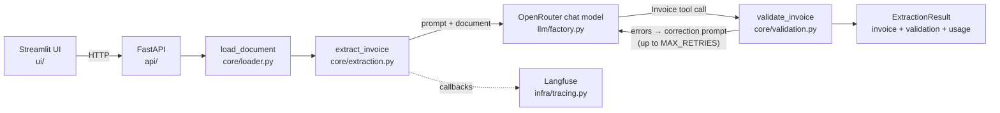

# Architecture

How invoice-extractor is put together and why. Scope and requirements live in
[`design.md`](design.md); the module graph is in [`code-map.md`](code-map.md).

## Overview

| Layer | Responsibility | May import |
|---|---|---|
| `core/` | models, validators, loader, retry loop, domain errors | `llm/prompts.py`, pydantic, langchain-core, pypdf |
| `llm/` | prompt templates, the single model factory | `core/`, `config` |
| `infra/` | Langfuse tracing adapter | `config` |
| `api/` | HTTP, error mapping, batch concurrency | everything except `ui/` |
| `ui/` | Streamlit pages, HTTP client | `config` only (never `core/`) |

`config.py` holds the single `Settings` object; every limit and URL comes from environment variables.

## Pipeline

1. **Load** (`core/loader.py`). PDFs are recognised by their `%PDF-` header, not the file name, and
   read with `pypdf`. Text files must be UTF-8. Empty files, oversized files (`MAX_UPLOAD_MB`),
   too many PDF pages (`MAX_PDF_PAGES`, checked before text extraction), too-long text
   (`MAX_TEXT_CHARS`), corrupt or encrypted PDFs and PDFs without a text layer are
   rejected with domain errors.
2. **Extract** (`core/extraction.py`). The injected extractor is a chat model wrapped with
   `with_structured_output(Invoice, include_raw=True)`. The prompt covers Italian and English
   documents, decimal commas, date formats and VAT rates.
3. **Validate** (`core/validation.py`). Pure functions, each returning readable error messages:
   line totals, net total, VAT per rate, gross = net + VAT, and the Italian partita IVA checksum.
4. **Self-correct**. Schema errors and validation errors are sent back with the previous output
   (up to `MAX_RETRIES`). If a check still fails, the result is returned with `valid: false`, the
   remaining errors and the retries used. If no attempt ever parses, `ExtractionError` is raised.

## Decisions and trade-offs

**Extractor injected as a runnable.** `core/` receives a runnable, never a provider client. Tests
drive the real `with_structured_output` parser with a fake tool-calling chat model, so the retry
loop is tested without network. *Trade-off:* the `Extractor` type is loose (`Runnable[..., Any]`)
because LangChain's structured output is untyped.

**Function calling for structured output.** `method="function_calling"` is the mode most widely
supported across OpenRouter models. Strict JSON-schema mode would reject optional fields with
defaults on some providers. *Trade-off:* the schema is a hint, not enforced by the provider, so
malformed output is possible; that is why schema errors feed the retry loop.

**Money is `Decimal`, shown to the model as a plain number.** Pydantic's default JSON schema for
`Decimal` is `number | string-with-pattern`, which some providers reject. A `WithJsonSchema`
override exposes `{"type": "number"}`, and a before-validator still accepts strings such as
`"1.234,56"` or `"1,234.56"` (the last separator is the decimal one). *Trade-off:* a lone
`"1.234"` is ambiguous and is read as 1.234; the prompt asks for dot-decimal numbers, so this only
matters for non-compliant output. In the API, money is serialized as strings to keep precision.

**VAT rounded once per rate.** Real invoices print a VAT summary per rate (riepilogo IVA), so the
expected VAT is `round(taxable_per_rate × rate)` summed over rates. The tolerance is one cent per
rate group. *Trade-off:* per-line rounding can differ by a few cents on long invoices with many
rates, and is accepted only within that tolerance.

**Party country added.** The design checks the Italian VAT number "when country is IT", but
`Party` had no country. It has an optional ISO `country`, and a VAT number prefixed with `IT` also
triggers the check.

**Documents with printed arithmetic errors stay invalid.** The prompt tells the model to keep the
values printed on the document. A document that is itself wrong (see
`samples/invoice_arithmetic_error.txt`) ends with `valid: false` after `MAX_RETRIES` attempts
instead of the model "fixing" the numbers. *Trade-off:* such documents always cost the maximum
number of calls.

**One trace per extraction.** The retry loop runs inside a `RunnableLambda` named
`extract_invoice`, so all attempts (`attempt_0`, `attempt_1`, …) are generations in one Langfuse
trace. Tracing is optional: without keys, `tracing_config` returns a plain config. The API returns
the trace URL; building it needs a Langfuse API call, which runs in a thread, and a failure there
is logged, never fatal.

**Usage and cost in the result.** The UI must show tokens, cost and latency (design, "UI and demo
polish"). The core sums `usage_metadata` over attempts, and the factory asks OpenRouter to
include the billed cost (`usage.include`). *Trade-off:* `cost_usd` is `null` with providers that
do not report cost; there is no local price table to keep up to date.

**Lazy, cached model creation.** `get_extractor` builds the model on first use, so the API starts
and `/health` answers even without `OPENROUTER_API_KEY`; extraction then returns 503 with a clear
message. *Trade-off:* a missing key is detected on the first request, not at startup.

**One `/extract` for files and JSON.** The route branches on the content type and parses the body
itself, with the OpenAPI schema declared by hand. Both routes check `Content-Length` before
Starlette buffers the body, and bodies without a length get 411. *Trade-off:* chunked uploads are
not supported.

**Batch concurrency with a semaphore.** `/extract/batch` runs files concurrently, at most
`BATCH_CONCURRENCY` at a time and `MAX_BATCH_FILES` per request. Each file's failure (invalid file,
LLM error) is reported in its own item instead of failing the request. PDF parsing runs in a
thread so it does not block the event loop.

**Error mapping.** Domain errors map to HTTP statuses through the class hierarchy: 413 too large,
415 unsupported, 422 empty or unparsable, 503 missing configuration. OpenAI-compatible provider
errors map to 502 with a generic message; details are only logged.

**UI over HTTP only.** The Streamlit app never imports `core/`; it calls the API with `httpx` and
turns failures into actionable messages. *Trade-off:* the demo needs both processes running, which
docker compose handles.

**One Docker image for api and ui.** Both services use the same image with different commands.
*Trade-off:* the API image also contains Streamlit (larger image), in exchange for one build and
one CI artifact. The image runs as a non-root user, and `.env` is never copied into it.

**Runtime-only dependencies.** `langchain` (needed by `langfuse.langchain`), `python-multipart`
(FastAPI forms) and `uvicorn` (server command) are never imported by our code. They are listed in
`[tool.deptry.per_rule_ignores]` so deptry stays strict for everything else.

## Testing

- `tests/unit`: validators (happy path, failures, rounding), VAT checksum, decimal parsing, loader
  (PDF, text, all rejections), retry loop with a fake model (fail then succeed, schema errors, no
  tool call, exhausted retries, usage, run naming), factory, tracing, every API route and error
  status, and the UI (`AppTest` with a stubbed backend, HTTP client error mapping).
- `tests/integration` (`-m integration`): the full pipeline on every sample file with a scripted
  model returning the expected JSON, plus a misread split-VAT invoice corrected on retry.
- `tests/llm` (`-m llm`, manual, costs money): field-level accuracy on the samples with the real
  model, threshold 90%.
