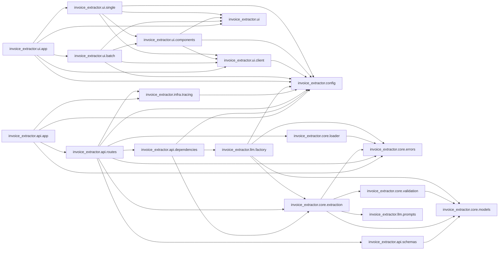

# Code map

Generated by `scripts/code_map.py`. Do not edit by hand.

## Modules not imported by any other module

- `invoice_extractor.api`
- `invoice_extractor.core`
- `invoice_extractor.infra`
- `invoice_extractor.llm`
